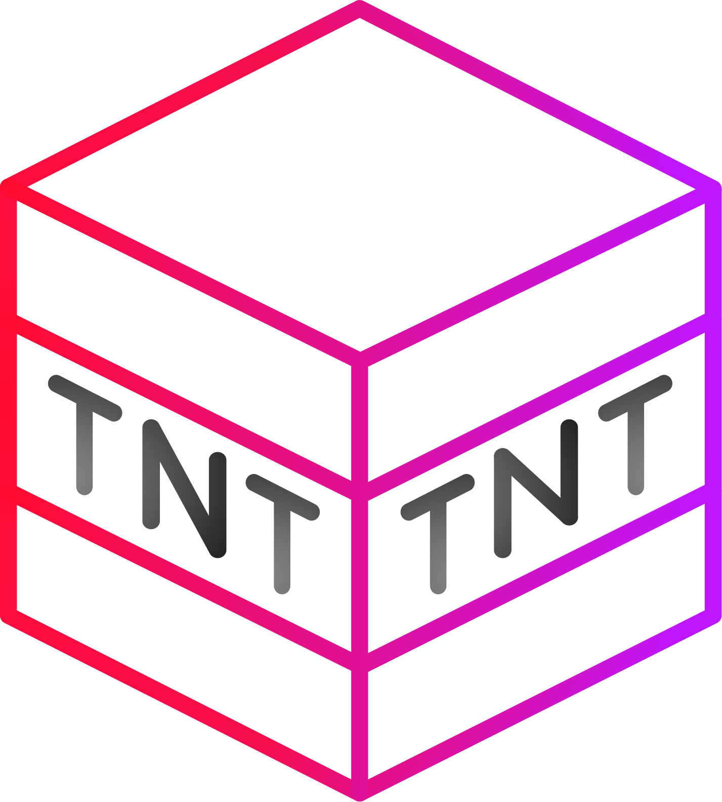

<div align="center">

</div>

# 💥 Bedwars TNT 💥
Small plugin intended to be used in Practice Servers to replicate TNT and Fireball behavior from Bedwars

# 🔧 Commands
* Reload `/bedwarstnt reload`
* Print knockback details `/bedwarstnt details knockback`
* Print other details `/bedwarstnt details other`

# 🔑 Permissions
* Administrator permission `bedwarstnt.admin`

# ❗ Server Software
This is intended to be used in PaperSpigot 1.8.8 and its forks, but in theory should work on modern versions, although with no official support

# ❗ Dependencies
Requires [KotLib](https://github.com/SerlithNetwork/KotLib) \
Also, you can instead fork the repository and **shade Kotlin** inside the jar

# ⚙️ How to compile
Just compile using gradle in the root project directory
```shell
./gradlew build
```

# ✒️ Credits
Took the idea from [HypixelTNT](https://dev.bukkit.org/projects/hypixeltnt) and ended up making my own version due to lack of customization
